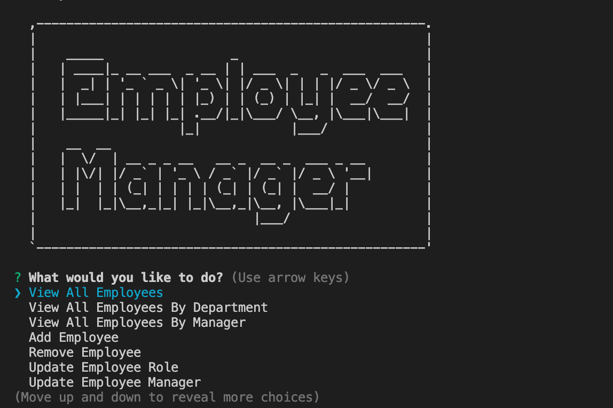

# **Employee-Tracker**

  ## **Description**
  This is a command-line application to manage a company's employee database, using Node.js, Inquirer, and MySQL.
  
  ## **Table of Contents**
  ### [Installation](#Installation)
  ### [Usage](#Usage) 
  ### [Contributing](#contributing)
    
  ## Installation
  Download the file and make sure you have the correct version of npm installed.
   
  ## Usage
  
    
  ## **License:**
  This project is protected under the MIT license.

  ## Contributing
  * npm inquirer package
  * MySql2 package
  * console.table package
  
  
  ## **Tests**
  Here is a quick tutorial of how the app is used:
  https://drive.google.com/file/d/1kZYBAJC86KIGtLipCET4OzRBT212eBPR/view
  
  ## **Questions**
  * Visit me at [gitHub](http://www.github.com/ryannekillian)
  * For additional questions, please reach me at: ryanne.killian@gmail.com
